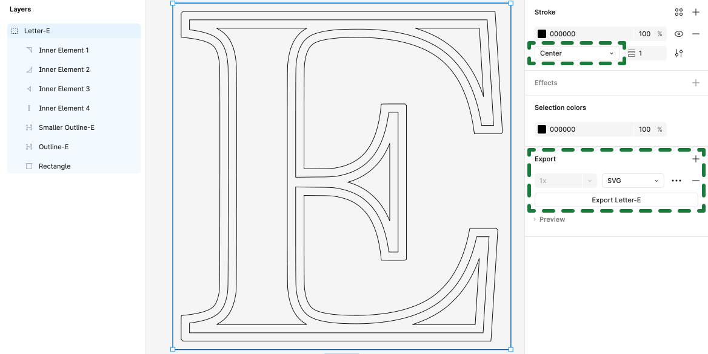

# SVG-to-TurtleStitch 🐢

A helper project to use SVG paths via a Google Spreadsheet in <a href="https://www.turtlestitch.org/">Turtle Stitch</a>.

## Outline

Turtle Stitch is excellent for creating both algorithmic and freeform patterns but generating precise, non-algorithmic designs can be challenging. To address this, I developed a workflow that allows you to design in a vector graphic tool like <a href="https://www.figma.com/">Figma </a> and export your creations as <a href="https://en.wikipedia.org/wiki/SVG">Scalable Vector Graphics (SVG)</a>. The paths within the SVG can then be converted into an array of x- and y-coordinates, which can easily be copied to your clipboard and pasted into a Google Spreadsheet. This data can subsequently be imported into Turtle Stitch, enabling you to create custom embroidery designs.

### Disclaimer:

While using tools other than Figma or Google Spreadsheets is perfectly fine, this guide will specifically focus on the process as it relates to my particular setup at hand.

Feel free to let me know if you need any more adjustments!

## How to

How to get from this…

…to this

### 1. Creating a vector graphic (in Figma)
This guide won't cover how to use Figma as such; it will only focus on what to keep in mind when designing for Turtle Stitch.

What to keep in mind

  1. Make sure that the design you want to export as SVG is not bigger than what your stitching machine can handle. In my case, I figured out that a design in Figma which is `900 x 650 pixels`, will result in a stitching of `18 x 13cm` (which is the maximum my machine can handle).
  2. Every line that shall get stitched separately (=not connected to another line) has to be its own layer in Figma which will result in an individual path per layer once the creation gets exported from Figma as an SVG.
  3. Make sure to set every single `Stroke` to `Center` to avoid strange artefacts in your exports.
  4. The order of the layers in Figma (from bottom to top) will translate to the order of the paths in the SVG (from first path to last path): top layer -> last path, second layer -> second to last path, last layer -> path 1. For complex designs, it might make sense to keep this in mind for a better overview.
  5. All the different paths (=single lines) in Figma have to be grouped to keep their position relative to each other. The entire group has to be exported as SVG.
  6. Designs have to be flipped (upside down) in Figma to show up correctly in Turtle Stitch.

#### Figma settings

### 2. Converting SVG to CSV

Instructions

  1. Open the [SVG-to-TurtleStitch converter](https://github.com/konki-vienna/SVG-to-TurtleStitch/blob/main/TurtleStitchPathTool%20v10.html)
  2. Upload your SVG file (`Letter-E.svg`
  3. Be happy
  4. 
  [I'm a relative reference to a repository file](../blob/main/TurtleStitchPathTool%20v10.html)

