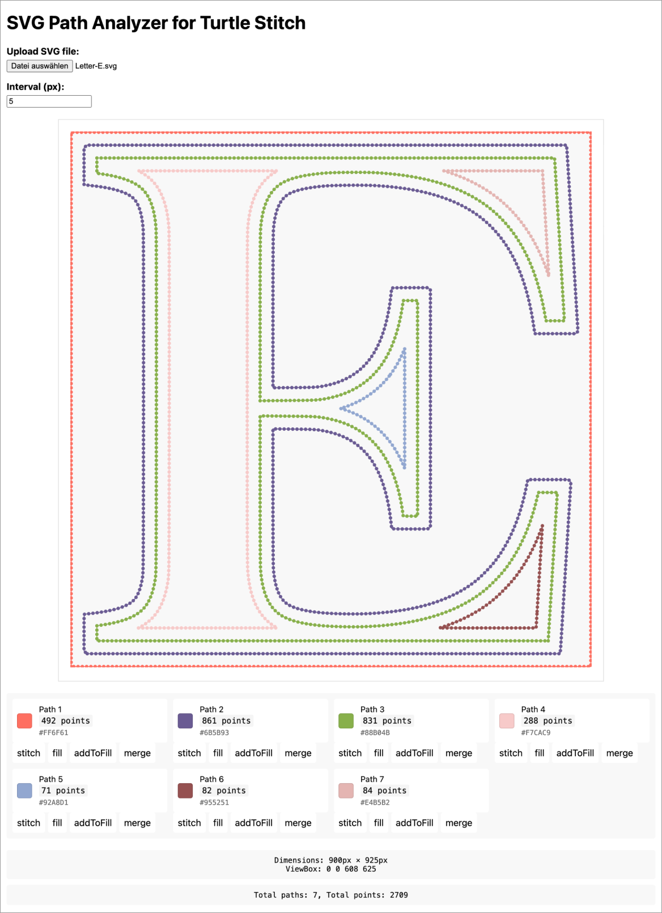
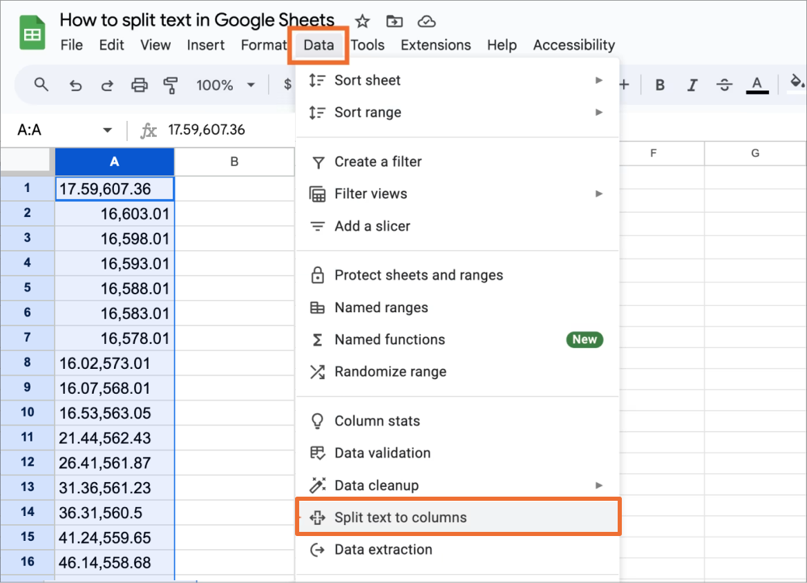
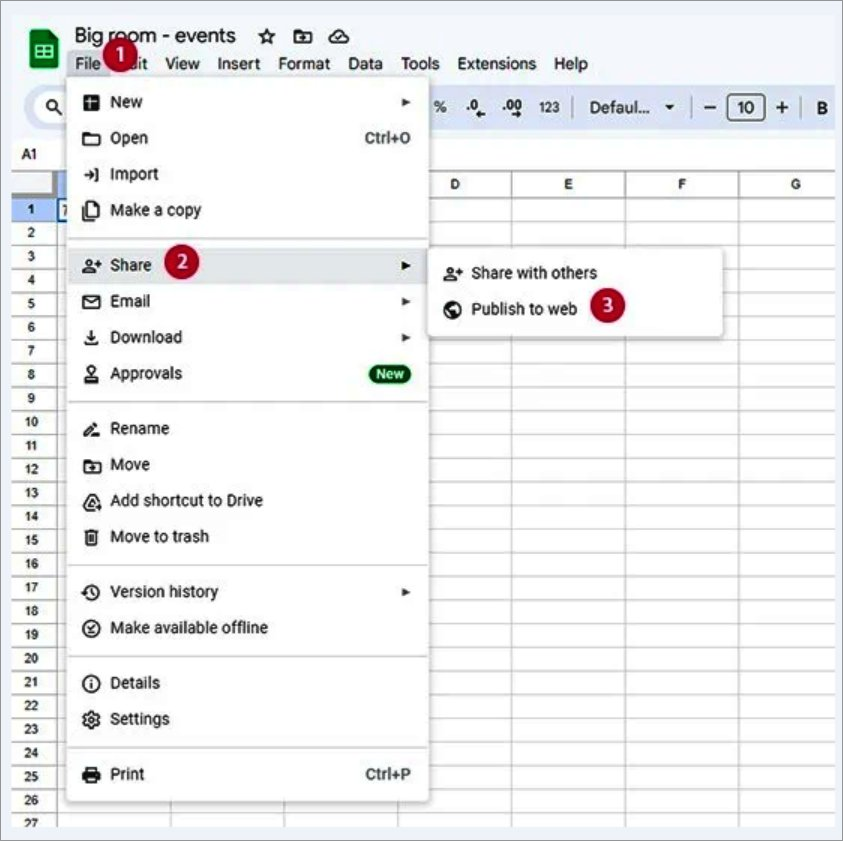
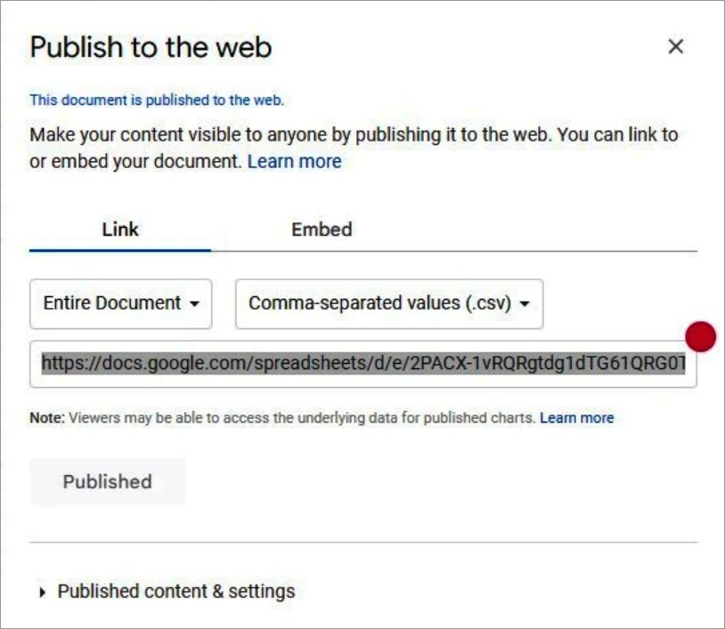
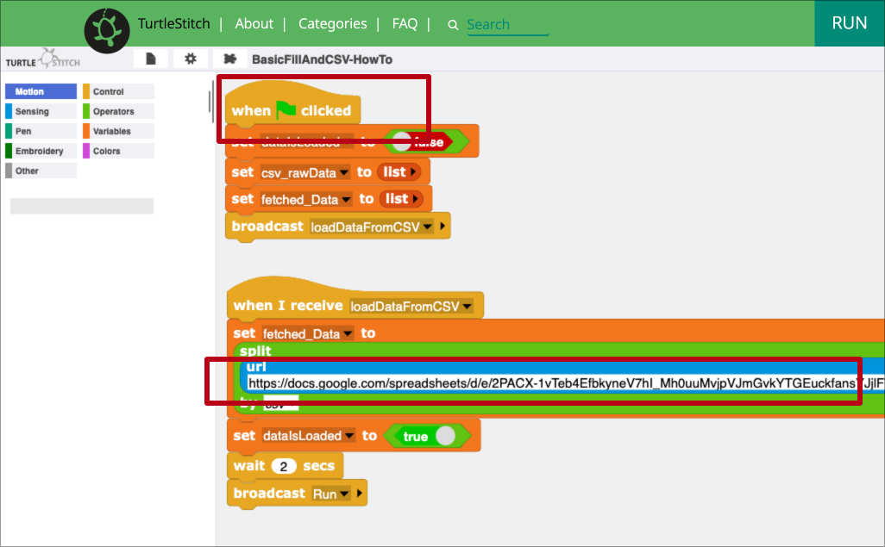

# SVG-to-TurtleStitch 🐢

A helper project to use SVG paths via a Google Spreadsheet in <a href="https://www.turtlestitch.org/">Turtle Stitch</a>.

## Outline

Turtle Stitch is excellent for creating both algorithmic and freeform patterns but generating precise, non-algorithmic designs can be challenging. To address this, I developed a workflow that allows you to design in a vector graphic tool like <a href="https://www.figma.com/">Figma </a> and export your creations as <a href="https://en.wikipedia.org/wiki/SVG">Scalable Vector Graphics (SVG)</a>. The paths within the SVG can then be converted into an array of x- and y-coordinates, which can easily be copied to your clipboard and pasted into a Google Spreadsheet. This data can subsequently be imported into Turtle Stitch, enabling you to create custom embroidery designs.

### Disclaimer:

While using tools other than Figma or Google Spreadsheets is perfectly fine, this guide will specifically focus on the process as it relates to my particular setup at hand.

Feel free to let me know if you need any more adjustments!

## How to

How to get from this…

…to this

### 1. Creating a vector graphic (in Figma)
This guide won't cover how to use Figma as such; it will only focus on what to keep in mind when designing for Turtle Stitch.

What to keep in mind

  1. Make sure that the design you want to export as SVG is not bigger than what your stitching machine can handle. In my case, I figured out that a design in Figma which is `900 x 650 pixels`, will result in a stitching of `18 x 13cm` (which is the maximum my machine can handle).
  2. Every line that shall get stitched separately (=not connected to another line) has to be its own layer in Figma which will result in an individual path per layer once the creation gets exported from Figma as an SVG.
  3. Make sure to set every single `Stroke` to `Center` to avoid strange artefacts in your exports.
  4. The order of the layers in Figma (from bottom to top) will translate to the order of the paths in the SVG (from first path to last path): top layer -> last path, second layer -> second to last path, last layer -> path 1. For complex designs, it might make sense to keep this in mind for a better overview.
  5. All the different paths (=single lines) in Figma have to be grouped to keep their position relative to each other. The entire group has to be exported as SVG.
  6. Designs have to be flipped (upside down) in Figma to show up correctly in Turtle Stitch.

#### Figma settings

#### SVG export
You can download the exported [SVG file here](https://raw.githubusercontent.com/konki-vienna/SVG-to-TurtleStitch/refs/heads/main/SVGs/Letter-E.svg).

### 2. Converting SVG paths to CSV output

Detailed Instructions

  1. Open the [SVG-to-TurtleStitch-Converter 🐢](https://html-preview.github.io/?url=https://github.com/konki-vienna/SVG-to-TurtleStitch/blob/main/TurtleStitchPathTool%20v10.html).
  2. Upload your SVG file (`Letter-E.svg`) to get a preview of the SVG - each path has a different colour.
  3. You can change the interval, which is the distance in pixels between two points on each SVG's path (x and y coordinates).
  4. Below the SVG preview, you have a set of legend items—one per SVG path. Hovering over a legend item will highlight the respective path and dim all other paths.
Tip: If the highlighted path is not visible because it is above the upper edge of your browser window, you can zoom out of the entire application (in Chrome <kbd>command</kbd> + <kbd>-</kbd>/<kbd>+</kbd>).
  5. Clicking on a legend item copies the path's x and y coordinates as a comma-separated array into the clipboard. Each legend item consists of four buttons:
     - The largest copies copies only the path's x and y coordinates as a comma-separated array into the clipboard
     - All other ones will copy the same data into the clipboard, but add the button labels `stitch`, `fill`, `addToFill` or `merge` as the last element of the array. These keywords can be used in TurtelStitch to do different things:
         - `stitch` will simply stitch the path in TurtelStitch
         - `fill` will stitch the path and fill it in TurtleStitch
         - `addToFill` and `merge` will stitch several paths and fill them in TurtleStitch in a way that overlapping parts of a path will not be filled. This allows the creation of filled areas and omits intersecting shapes.
      
#### The SVG-to-TurtleStitch-Converter interface

### 3. Save CSV output in Google spreadsheet

Detailed Instructions

  1. Open a new spreadsheet in your Google Drive account.
  2. Put the spreadsheet's focus on table cell `A1`.
  3. Paste the data from the clipboard into the spreadsheet.
  4. With <kbd>command</kbd>+<kbd>▼</kbd> jump to the last populated cell in column `A`.
  5. Make sure that the last element of column `A` is either the keyword `stitch` or `fill`.
  6. Select the entire column `A` by clicking on the column's table header.
  7. In the menu go to `Data` > `Split text to columns`. Now you have all x-coordinates in column `A` and all y-coordinates in column `B`.
  
  8. In the menu go to  `File` > `Share` > `Publish to web` to make your data accessible to TurtleStitch.
  
  9. In the next screen select instead of `Entire Document` the tab you want to share. In the second dropdown choose `Comma-separated values (.csv)`.

  
  
  10. Then click on publish and copy the URL.

### 4. Import Data to TurtleStitch and run it

Detailed Instructions

  1. Open [the example project in TurtleStitch](https://turtlestitch.org/run#cloud:Username=konki_vienna&ProjectName=BasicFillAndCSV-HowTo).
  2. Paste the URL from your clipboard into the light blue `URL block` in the second coding block of the project.
  3. Then hit the yellow `When 🚩 clicked` blog in the topmost coding block of the project to run the project.

</details

## [Video walk trough](#walk-through-anchor)

